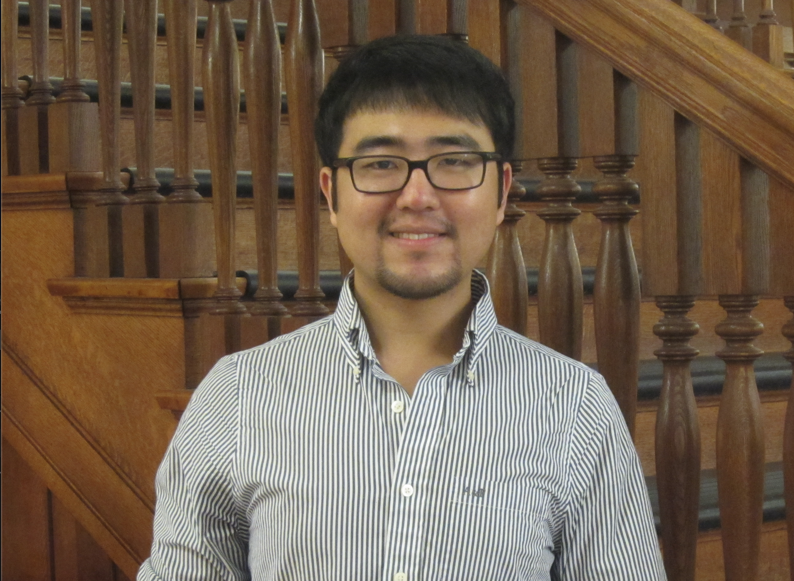

<br>

Welcome. My name is Jiaqi (Jackie) Lu, I am a Ph.D. student in the [Department of Political Science](https://polisci.wisc.edu/) and [Nelson Institute for Environmental Studies](https://nelson.wisc.edu/) (joint Ph.D. program) at the [University of Wisconsin–Madison](https://www.wisc.edu/). My research interests include the political economy of energy transitions and climate change, as well as the intersection of governance and technology development. My research has appeared or forthcoming in Nature Geoscience, Energy Policy, Environmental Research Letter, and so on. 

I received my B.A. in Sociology and M.A. in International Public Affairs (2014) from UW-Madison. Before coming back to Madison for Ph.D. in 2018, I was a research analyst at the [Brookings Institution](https://www.brookings.edu/) (2015-2018), where I worked on energy and climate policy. 

I welcome any advice and feedback about my research work. Please do not hesitate to [send me an email](mailto:jackie.lu@wisc.edu).
<br>
<br>
<br>
<br>
<br>
<br>
<br>
<center> Copyright © Jiaqi (Jackie) Lu, 2020
<center>  I built my website with . You should [try it](https://rmarkdown.rstudio.com/) too.
```{r setup, include=FALSE}
knitr::opts_chunk$set(echo = TRUE)

# Learn more about creating websites with Distill at:
# https://rstudio.github.io/distill/website.html

```
